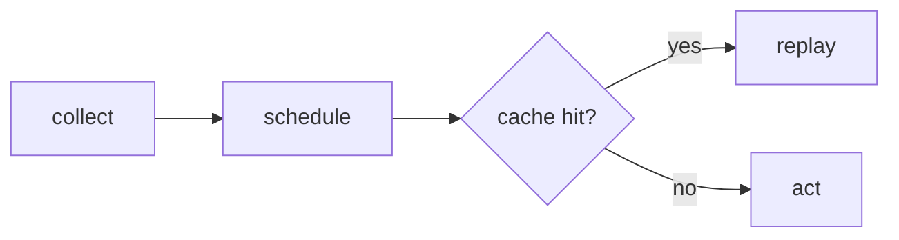

# Writing a PR title and body

Reviewers skim. Put the shape of the change on the first screen, then let
diagrams and code carry the detail.

## Title

- Conventional Commits, matching `git log`:
  `fix(playwright): provision the browser in a runner-side prepare hook`.
  PRs squash-merge with the number appended, so the title is the commit.
- Mark spec or API breaks with `!` (`feat(config)!: ...`), same as the commit.
- Name the outcome, not the activity. "install builds with the appPath
  option", not "agent-device changes".

## Body

Do not write essays. A few bullets on what changed and why, then evidence.

- Bullet points for the prose you do write. One fact per bullet.
- A mermaid diagram for anything with flow or state: runner phases, engine
  hooks, replay paths, before/after architecture.
- Code samples: the new API, sample usage in a test file, or the key internal
  snippet. Fenced blocks with a language tag.
- Code refs (`packages/e2e/src/run/execute.ts:42`, GitHub permalinks) instead
  of paraphrasing code.
- Visual changes, direct or indirect (CLI output, reporter output, docs
  pages): a before/after table with uploaded images or videos.
- Benchmarks: a before/after table. Baseline is the target branch, candidate
  is the PR.
- Spec changes: name the chapter, schema, and `suiteVersion` bump in one
  bullet so the reviewer can check them together.
- A `## Verified` section, required on every PR:
  - First line: `Ran it locally: yes`, or `Ran it locally: no - <why>`
    (docs typo, CI-only, a device you do not have).
  - With `yes`: the [verify](../verify/SKILL.md) surface, the command you
    ran, what you saw, and the CLI output, screenshots, or video showing it
    work.
  - A `fix` PR with `yes` also shows the bug and the fix side by side in a
    `| main | this branch |` table.
  - Upload media with `gh` 2.99+ `--attach`: reference images in the body as
    markdown (``) and pass each file as `--attach`; `gh`
    uploads them and rewrites those paths. Do not write video paths in the
    body: attached videos are appended at the end and render as players.

## Leave out

- "I ran lint/tests" lists. CI reports that; `## Verified` is for what CI
  cannot see.
- Intermediate history. Squashed 6k lines down to 1k, refactored twice,
  renamed midway: none of it lands. Only the final aggregate squash-merge
  commit exists, so only that gets commentary.
- Line-by-line restating of the diff.
- Checklists nobody asked for, sign-offs, filler.

## Templates

Before/after for visuals:

```markdown
| Before | After |
| --- | --- |
|  |  |
```

Verified, for a fix (local image paths become uploaded assets with `--attach`):

```markdown
## Verified

Ran it locally: yes
- testbed, `e2e run tests/scroll.e2e.ts --video`: the new test fails on main
  and passes here

| main | this branch |
| --- | --- |
|  |  |
```

`gh pr edit <pr> --body-file body.md --attach ./main.png --attach ./branch.png --attach ./video.webm`

Benchmarks:

```markdown
| Scenario | main | this PR | delta |
| --- | --- | --- | --- |
| testbed default suite | 41s | 23s | -44% |
```

Flow:

````markdown

````

## Big changes

For truly impressive, difficult, high-risk, or wide-scoped changes, write the
body like a technical blog post: context, the problem, the approach, code
samples, diagrams, before/after, images. Storytelling is fine here. The rules
above still hold: run output only as `## Verified` evidence, no
intermediate history.

## Voice

Run the [unslop](../unslop/SKILL.md) pass on the final text before posting.
PR-specific tells to catch:

- "This PR introduces...", "comprehensive", "robust", "seamless", "ensures",
  "leverages", "enhances".
- Bold label lists that restate the line (`**Performance:** Performance...`).
- Em dashes. Use a comma, a colon, or a new sentence.
- Bullets padded to three because three felt right.
- A summary that could be pasted unchanged into another repo's PR.
